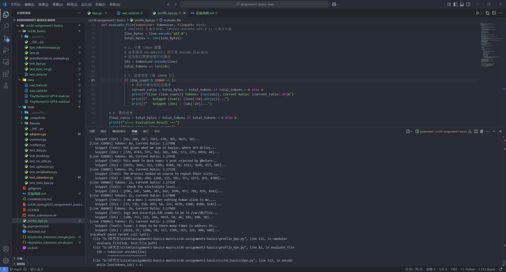

# 实验流程

## 1.环境配置

### 1.1 环境

```bash
uv sync --python 3.11
```

### 1.2 测试

win环境下运行，需要注释掉test_tokenizer.py 文件中的import resource

### 1.3 下载数据

#### 下载 TinyStories 数据集

训练集：

```bash
curl -L -o TinyStoriesV2-GPT4-train.txt https://hf-mirror.com/datasets/roneneldan/TinyStories/resolve/main/TinyStoriesV2-GPT4-train.txt
```

验证集：

```bash
curl -L -o TinyStoriesV2-GPT4-valid.txt https://hf-mirror.com/datasets/roneneldan/TinyStories/resolve/main/TinyStoriesV2-GPT4-valid.txt
```

#### 下载 OpenWebText 数据集

训练集（压缩包）：

```bash
curl -L -o owt_train.txt.gz https://hf-mirror.com/datasets/stanford-cs336/owt-sample/resolve/main/owt_train.txt.gz
```

验证集（压缩包）：

```bash
curl -L -o owt_valid.txt.gz https://hf-mirror.com/datasets/stanford-cs336/owt-sample/resolve/main/owt_valid.txt.gz
```

#### 解压数据集

```bash
gunzip owt_train.txt.gz
gunzip owt_valid.txt.gz
```

## 2 Byte-Pair Encoding (BPE) Tokenizer

## 2.1 The Unicode Standard

### Problem (unicode1): Understanding Unicode (1 point)

**(a) What Unicode character does `chr(0)` return?**

> **Deliverable:** A one-sentence response.

**Answer:**
It returns the Null character (often represented as `\x00`).
*(返回空字符 \x00)*

---

**(b) How does this character’s string representation (`__repr__()`) differ from its printed representation?**

> **Deliverable:** A one-sentence response.

**Answer:**
The string representation (`__repr__`) shows the escape sequence `'\x00'` to explicitly indicate its presence, while the printed representation renders nothing (it is invisible/non-printing).

* **交互示例：**
  * 直接输入 `chr(0)` -> 显示 `'\x00'`
  * 输入 `print(chr(0))` -> 显示为空白（看不到任何东西）

---

**(c)** What happens when this character occurs in text? It may be helpful to play around with the following in your Python interpreter and see if it matches your expectations:

```python
>>> chr(0)
>>> print(chr(0))
>>> "this is a test" + chr(0) + "string"
>>> print("this is a test" + chr(0) + "string")
```

**Deliverable:** A one-sentence response.
**运行结果**

```python
>>> chr(0)
'\x00'
>>> print(chr(0))

>>> "this is a test" + chr(0) + "string"
'this is a test\x00string'
>>> print("this is a test" + chr(0) + "string")
this is a teststring
```

## 2.2 Unicode Encodings

Problem (unicode2): Unicode Encodings (3 points)
(a) What are some reasons to prefer training our tokenizer on UTF-8 encoded bytes, rather than
UTF-16 or UTF-32? It may be helpful to compare the output of these encodings for various
input strings.
Deliverable: A one-to-two sentence response.

> * 空间效率：互联网上的文本（以及代码）大部分是英文。UTF-8 对英文（ASCII）只需要 1 个字节，而 UTF-32 无论什么字符都要 4 个字节，UTF-16 至少要 2 个字节。

> * 稀疏性：如果你用 UTF-32，会有大量的 0x00 字节（空字节）填充，这对于模型训练来说是无效信息的浪费。

(b) Consider the following (incorrect) function, which is intended to decode a UTF-8 byte string into
a Unicode string. Why is this function incorrect? Provide an example of an input byte string
that yields incorrect results.
def decode_utf8_bytes_to_str_wrong(bytestring: bytes):
return "".join([bytes([b]).decode("utf-8") for b in bytestring])

```python
>>> decode_utf8_bytes_to_str_wrong("hello".encode("utf-8"))
'hello'
```

Deliverable: An example input byte string for which decode_utf8_bytes_to_str_wrong produces incorrect output, with a one-sentence explanation of why the function is incorrect.

> UTF-8 是变长编码。
> “牛”字在 UTF-8 里由 3 个字节组成（例如 [227, 137, 155]）。
> 这个错误的函数试图把 227 单独拿出来解码，把 137 单独拿出来解码。
> 但是在 UTF-8 规则里，这些字节必须合在一起才有意义，单独拆开就是无效的乱码。

(c) Give a two byte sequence that does not decode to any Unicode character(s).
Deliverable: An example, with a one-sentence explanation.
合法编码：

|字节数|	格式 (二进制)	|含义|
| :--- | :--- | :--- |
|1 字节	|0xxxxxxx	|单字节字符 (ASCII)。看到 0 开头，它就是独立的。|
|2 字节	|110xxxxx 10xxxxxx|	110 开头是火车头，告诉计算机“我要占2个字节”。后面必须跟 1 个 10 开头的字节。|
|3 字节	|1110xxxx 10xxxxxx 10xxxxxx|	1110 开头是火车头，后面必须跟 2 个 10 开头的字节。|
|4 字节	|11110xxx 10xxxxxx 10xxxxxx 10xxxxxx|	11110 开头是火车头，后面必须跟 3 个 10 开头的字节。|

> 非法编码：0xFF

## 2.3 Subword Tokenization

## 2.4 BPE Tokenizer Training

## 2.5 Experimenting with BPE Tokenizer Training

### 2.5.1 Parallelizing pre-tokenization

### 2.5.2 Removingspecialtokensbeforepre-tokenization

### 2.5.3 Optimizing the merging step

* 数据结构
> 

### 测试
在 tests/adapters.py 的 run_train_bpe 中调用函数：
```python
    from cs336_basics.bpe import train_bpe
    return train_bpe(input_path,vocab_size,special_tokens)
```
```python
uv run pytest tests/test_train_bpe.py

uv run pytest -m cProfile -s time tests/test_train_bpe.py
```
### 数据结构
* word_counts：
```python
{
    ('h', 'e', 'l', 'l', 'o'): 500,  # "hello" 这个词出现了 500 次
    ('h', 'e', 'r', 'o'): 300,       # "hero" 出现了 300 次
    ('w', 'o', 'r', 'l', 'd'): 800   # "world" 出现了 800 次
}
```
* pair_counts
```python
{
    ('h', 'e'): 800,  # 500 (来自hello) + 300 (来自hero) = 800次
    ('e', 'l'): 500,  # 只在 hello 里出现了 500 次
    ('l', 'l'): 500,  
    ('e', 'r'): 300,  # 只有 hero 里有
    # ... 其他组合
}
```
* pair_to_words（倒排索引）
```python
{
    ('h', 'e'): { ('h', 'e', 'l', 'l', 'o'), ('h', 'e', 'r', 'o') },
    ('w', 'o'): { ('w', 'o', 'r', 'l', 'd') },
    # ...
}
```
---

* vocab:(dict)
> int : Bytes
```python
{
    # ... 0~255 是基础的单字节
    104: b'h',
    101: b'e',
    # ...
    256: b'he',    # 第一个被合并出来的新 Token
    257: b'hel',   # 假设后来 'he' 和 'l' 又被合并了
    # ...
}
```
* merges:   (list)
> list[tuple[bytes, bytes]]
```python
[
    (b'h', b'e'),      # 第 1 次合并（对应 ID 256）
    (b'he', b'l'),     # 第 2 次合并（对应 ID 257）
    (b'hel', b'lo'),   # ...
]
```
## 2.6
### 数据结构
* vocab:(dict)
> int : Bytes
* bytes_to_id:(dict)
> Bytes : int
* merges:(dict)
> (int, int) : int

git bash:
```bash
PYTHONUTF8=1 uv run pytest tests/test_tokenizer.py
```
## 2.7 Experiments
用tinystories训练好的tokenizer，encode owt_valid.txt
运行cs336_basics下运行

### profile_bpe.py 脚本使用

**1. 训练 TinyStories **
```bash
uv run .\profile_bpe.py --mode train --data tinystory
```
**2. 测试 TinyStories (计算压缩率)**
```bash
python tokenizer.py --mode test --data tinystory
```
**3. 训练 OWT (OpenWebText)**
```bash
uv run .\profile_bpe.py --mode train --data owt
```

**4. 交叉测试 (用 TinyStory 的 Tokenizer 测试 OWT 数据集)**
```bash
python tokenizer.py --mode test --data owt --model_prefix tinystories_tokenizer
```
```bash
uv run .\profile_bpe.py
```
tokenizer’s compression ratio (bytes/token)
大约是3.17


